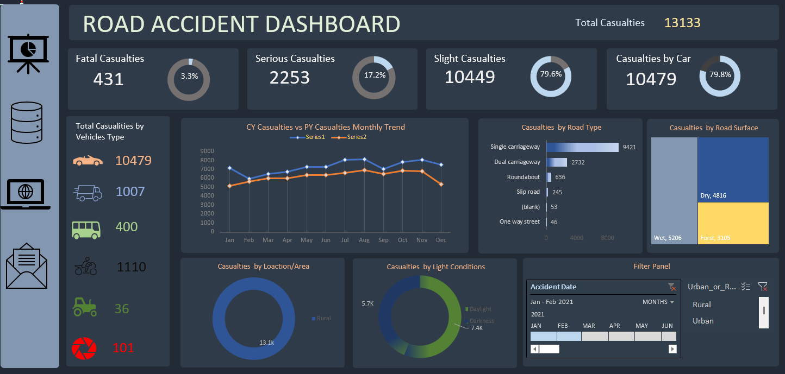

# 🚗 Road Accidents Analysis Dashboard (Excel)

## 📌 Description

This project presents an interactive Excel dashboard to analyze road accident data. It helps identify trends, accident severity, and key factors such as road type, surface conditions, and vehicle involvement.

## 🎯 Objectives

* Analyze accident trends over time
* Identify high-risk road types
* Understand accident severity (Fatal, Serious, Slight)
* Study the impact of road and environmental conditions

## 📊 Dashboard Features

* 📅 Monthly accident trend analysis (CY vs PY comparison)
* ⚠️ Casualties breakdown (Fatal, Serious, Slight)
* 🚙 Vehicle type-wise casualties
* 🛣️ Road type analysis (Single, Dual, Roundabout, etc.)
* 🌧️ Road surface conditions (Dry, Wet, Frost)
* 🌍 Location-based insights (Urban vs Rural)
* 🌙 Light condition analysis (Daylight vs Darkness)
* 🎛️ Interactive filters (Date & Area selection)

## 🛠️ Tools & Skills Used

* Microsoft Excel
* Pivot Tables & Pivot Charts
* Slicers & Interactive Dashboard
* Data Cleaning & Data Analysis
* Data Visualization

## 📁 Project File

👉 https://docs.google.com/spreadsheets/d/1XBaboRn8Ln5soovaaLMaQkRaSZOvyzv5/edit?usp=sharing&ouid=102466818119527412573&rtpof=true&sd=true

## 📸 Dashboard Preview

## 🚀 How to Use

1. Open the link above
2. Download or view the file in Excel
3. Use slicers to filter data by date and location
4. Explore charts to gain insights

## 💡 Key Insights

* Majority of accidents occur on **single carriageway roads**
* Most accidents happen in **dry road conditions**
* Urban areas show higher accident frequency compared to rural
* Slight casualties are significantly higher than fatal and serious cases

## 📎 GitHub Repository

(Add your repository link here)

---

## 👤 Author

Arul Hariharan S
(Student | Aspiring Data Analyst)
